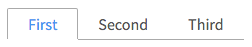

# Tabs

Vertical and horizontal tabs.



```jsx
import Tabs from 'patchkit-tabs'

// horizontal:
<Tabs tabs={['First', 'Second', 'Third']} selected={this.state.selected} onSelect={tab=>this.setState({ selected: tab })} />

// vertical:
<Tabs vertical tabs={['First', 'Second', 'Third']} selected={this.state.selected} onSelect={tab=>this.setState({ selected: tab })} />
```

If you want the rendering to change when selected, use:

```jsx
const TABS = [
  { selectedLabel: '1st!', unselectedLabel: 'First' },
  { selectedLabel: '2nd!', unselectedLabel: 'Second' },
  { selectedLabel: '3rd!', unselectedLabel: 'Third' }
]
<Tabs tabs={TABS} selected={this.state.selected} onSelect={tab=>this.setState({ selected: tab })} />
```

Can also set `className`.

## Styles

Use the .less file:

```less
@import "node_modules/patchkit-tabs/styles.less"
```